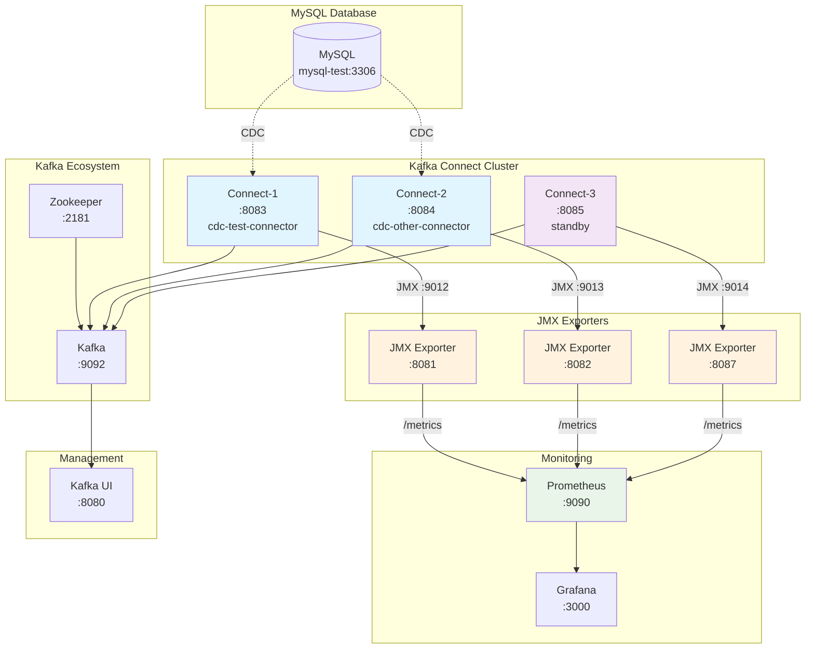

# Kafka Connect Distributed Mode JMX Monitoring

Kafka Connect distributed mode에서 여러 Debezium connector의 JMX 메트릭을 중앙 집중화하여 모니터링하는 시스템입니다.

## Run

```shell
docker compose up -d
npm run start
```

## 🏗️ Architecture



## 🎯 Key Features

- **중앙 집중화**: 단일 Prometheus에서 모든 Debezium connector의 JMX 메트릭 수집
- **실시간 모니터링**: Connected 상태를 포함한 다양한 Debezium 메트릭 실시간 수집
- **확장성**: 새로운 connector 추가 시 동일한 구조로 모니터링 가능
- **고가용성**: Kafka Connect distributed mode로 고가용성 보장

## 📊 Prometheus Queries

### 기본 Connected 상태 조회

```promql
# 모든 Debezium connector의 Connected 상태
debezium_mysql_connected

# 특정 database의 Connected 상태
debezium_mysql_connected{server=~".*database=test.*"}
```

### 고급 쿼리 예시

```promql
# 연결이 끊어진 connector 찾기
debezium_mysql_connected == 0

# 지난 5분간 연결 상태 변화
changes(debezium_mysql_connected[5m])

# Streaming 지연 시간 모니터링
debezium_mysql_streaming_MilliSecondsBehindSource

# 스냅샷 완료 상태
debezium_mysql_snapshot_SnapshotCompleted

# 처리된 이벤트 수
debezium_mysql_streaming_TotalNumberOfEventsSeen

# 에러 이벤트 수
debezium_mysql_streaming_NumberOfErroneousEvents
```

### Dashboard용 쿼리

```promql
# 전체 connector 개수
count(debezium_mysql_connected)

# 정상 작동 중인 connector 개수
count(debezium_mysql_connected == 1)

# 연결 실패율 (%)
(count(debezium_mysql_connected == 0) / count(debezium_mysql_connected)) * 100
```

## 🌐 HTTP API Queries

Prometheus HTTP API를 통해 프로그래밍 방식으로 메트릭을 조회할 수 있습니다.

### 기본 쿼리 (Instant Query)

```bash
# 모든 connector의 현재 Connected 상태
curl "http://localhost:9090/api/v1/query?query=debezium_mysql_connected"

# 특정 database의 Connected 상태 (URL 인코딩 필요)
curl "http://localhost:9090/api/v1/query?query=debezium_mysql_connected%7Bserver%3D~%22.*database%3Dtest.*%22%7D"

# 연결이 끊어진 connector 찾기
curl "http://localhost:9090/api/v1/query?query=debezium_mysql_connected%20%3D%3D%200"
```

### Range 쿼리 (시간 범위)

```bash
# 지난 1시간 동안의 Connected 상태 변화
curl "http://localhost:9090/api/v1/query_range?query=debezium_mysql_connected&start=$(date -d '1 hour ago' -u +%Y-%m-%dT%H:%M:%S.000Z)&end=$(date -u +%Y-%m-%dT%H:%M:%S.000Z)&step=60s"

# 지난 24시간 동안의 지연시간 (5분 간격)
curl "http://localhost:9090/api/v1/query_range?query=debezium_mysql_streaming_MilliSecondsBehindSource&start=$(date -d '24 hours ago' -u +%Y-%m-%dT%H:%M:%S.000Z)&end=$(date -u +%Y-%m-%dT%H:%M:%S.000Z)&step=300s"
```

### JSON 파싱과 jq 사용

```bash
# Pretty print JSON response
curl -s "http://localhost:9090/api/v1/query?query=debezium_mysql_connected" | jq '.'

# Connected 값만 추출
curl -s "http://localhost:9090/api/v1/query?query=debezium_mysql_connected" | jq '.data.result[].value[1]'

# 각 connector의 서버명과 Connected 상태 추출
curl -s "http://localhost:9090/api/v1/query?query=debezium_mysql_connected" | jq '.data.result[] | {server: .metric.server, connected: .value[1]}'

# 연결된 connector 개수 계산
curl -s "http://localhost:9090/api/v1/query?query=count(debezium_mysql_connected%20%3D%3D%201)" | jq '.data.result[0].value[1]'
```

### JavaScript/Node.js 예시

```javascript
// 간단한 헬스체크 함수
async function checkConnectorHealth() {
  const response = await fetch(
    "http://localhost:9090/api/v1/query?query=debezium_mysql_connected"
  );
  const data = await response.json();

  const connectors = data.data.result.map((result) => ({
    server: result.metric.server,
    instance: result.metric.instance,
    connected: result.value[1] === "1",
    timestamp: new Date(result.value[0] * 1000),
  }));

  return connectors;
}

// 사용 예시
checkConnectorHealth().then((connectors) => {
  console.log("Connector Status:");
  connectors.forEach((c) => {
    console.log(
      `- ${c.server}: ${c.connected ? "✅ Connected" : "❌ Disconnected"}`
    );
  });
});
```

### Python 예시

```python
import requests
import json
from datetime import datetime

def get_connector_status():
    url = "http://localhost:9090/api/v1/query"
    params = {"query": "debezium_mysql_connected"}

    response = requests.get(url, params=params)
    data = response.json()

    connectors = []
    for result in data['data']['result']:
        connectors.append({
            'server': result['metric']['server'],
            'instance': result['metric']['instance'],
            'connected': result['value'][1] == '1',
            'timestamp': datetime.fromtimestamp(float(result['value'][0]))
        })

    return connectors

# 사용 예시
if __name__ == "__main__":
    connectors = get_connector_status()
    print("Connector Status:")
    for c in connectors:
        status = "✅ Connected" if c['connected'] else "❌ Disconnected"
        print(f"- {c['server']}: {status}")
```

### 모니터링 스크립트 예시

```bash
#!/bin/bash
# connector-health-check.sh
# 모든 connector의 상태를 확인하고 알림을 보내는 스크립트

PROMETHEUS_URL="http://localhost:9090"
WEBHOOK_URL="YOUR_SLACK_WEBHOOK_URL"  # 선택사항

# Connected 상태 확인
check_connected() {
    local result=$(curl -s "${PROMETHEUS_URL}/api/v1/query?query=debezium_mysql_connected%20%3D%3D%200" | jq '.data.result | length')

    if [ "$result" -gt 0 ]; then
        echo "❌ Warning: $result connector(s) disconnected!"

        # 연결이 끊어진 connector 목록
        curl -s "${PROMETHEUS_URL}/api/v1/query?query=debezium_mysql_connected%20%3D%3D%200" | \
        jq -r '.data.result[] | "- \(.metric.server) on \(.metric.instance)"'

        # Slack 알림 (선택사항)
        # curl -X POST -H 'Content-type: application/json' \
        #      --data "{\"text\":\"🚨 Debezium Connector Alert: $result connector(s) disconnected\"}" \
        #      $WEBHOOK_URL

        exit 1
    else
        echo "✅ All connectors are connected"
        exit 0
    fi
}

check_connected
```

## 🚀 Getting Started

1. **서비스 시작**

   ```bash
   docker compose up -d
   ```

2. **Prometheus 접속**

   - URL: http://localhost:9090
   - Query: `debezium_mysql_connected`

3. **Kafka UI 접속**
   - URL: http://localhost:8080

## 📋 Services

| Service        | Port | Description               |
| -------------- | ---- | ------------------------- |
| MySQL          | 3306 | Source database           |
| Zookeeper      | 2181 | Kafka coordination        |
| Kafka          | 9092 | Message broker            |
| Connect-1      | 8083 | Kafka Connect instance #1 |
| Connect-2      | 8084 | Kafka Connect instance #2 |
| Connect-3      | 8085 | Kafka Connect instance #3 |
| JMX Exporter-1 | 8081 | Metrics for Connect-1     |
| JMX Exporter-2 | 8082 | Metrics for Connect-2     |
| JMX Exporter-3 | 8087 | Metrics for Connect-3     |
| Prometheus     | 9090 | Metrics collection        |
| Kafka UI       | 8080 | Kafka management UI       |

## 🔧 Configuration

- **JMX Configuration**: `jmx-exporter-config.yml`
- **Prometheus Configuration**: `prometheus.yml`
- **Connector Setup**: `.debezium/connector-setup.sh`

## 📝 Connectors

- **cdc-test-connector**: Monitors `test` database
- **cdc-other-connector**: Monitors `other` database

## 🎪 Monitoring Targets

- Debezium MySQL Connected status
- Streaming metrics (events, lag, errors)
- Snapshot metrics (progress, completion)
- Schema history metrics
- Kafka Connect worker metrics
