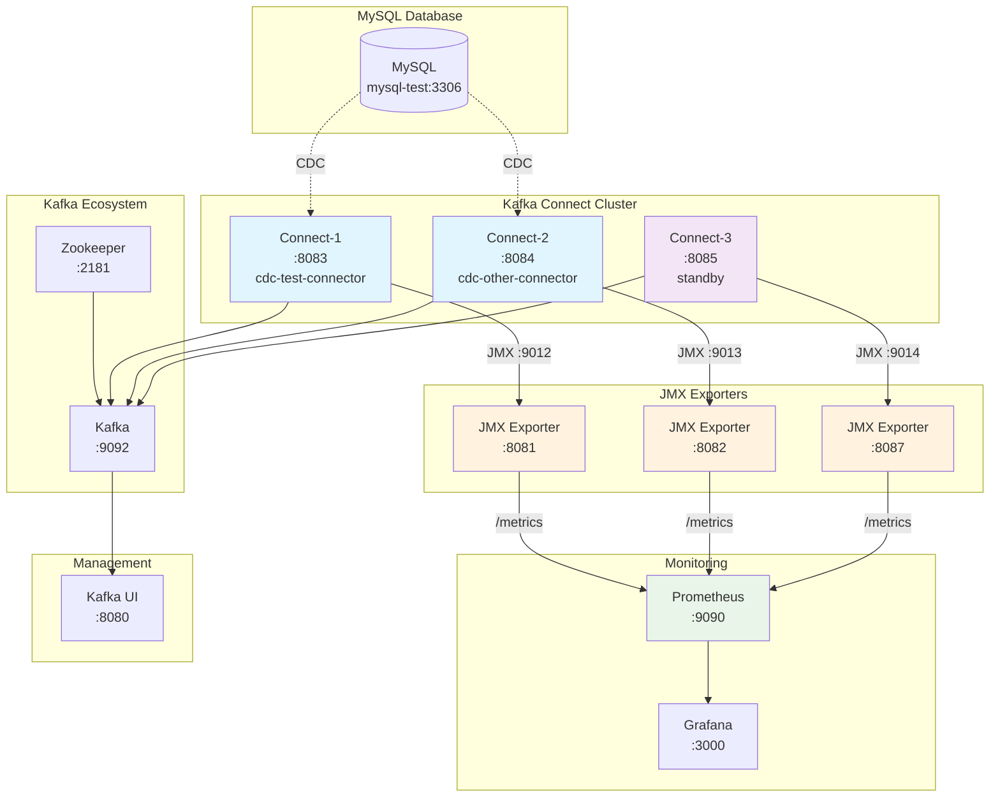

# Kafka Connect Distributed Mode JMX Monitoring

Kafka Connect distributed mode에서 여러 Debezium connector의 JMX 메트릭을 중앙 집중화하여 모니터링하는 시스템입니다.

## Run

```shell
docker compose up -d
npm run start
```

## 🏗️ Architecture


